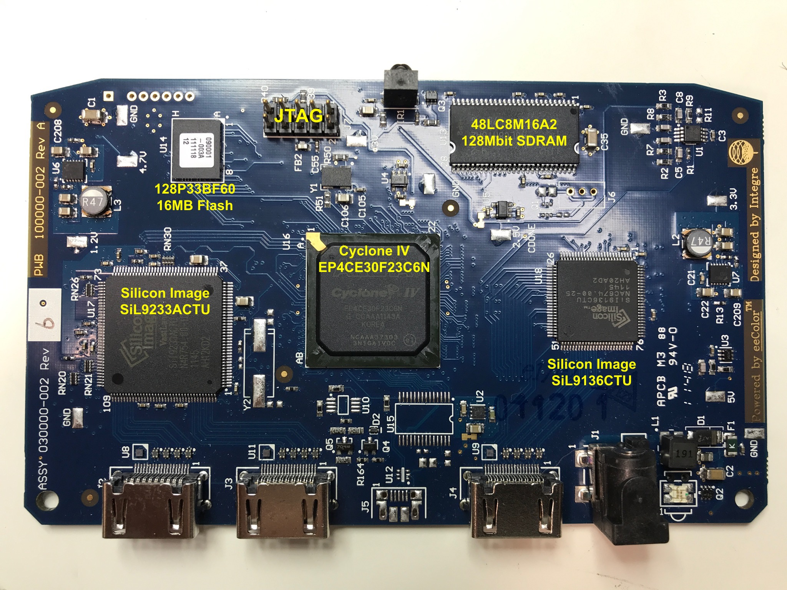

# Introduction

This repo contains information about the (obsolete) eeColor Color3 board.

Most of the information on this page  was copied from 
[this blog post](http://www.taylorkillian.com/2013/04/using-fpga-of-eecolor-color3.html) by Taylor Killian. That blog
posts got [attention on Hackaday](https://hackaday.com/2013/05/08/hdmi-color-processing-board-used-as-an-fpga-dev-board-to-mine-bitcoins/), though
no additional useful information was added.

My log about reverse engineering this board can be found on [this Hackaday project page](https://hackaday.io/project/122480-eecolor-color3).

# Status

* All the known important connections to the FPGA have been identified.
* the `bringup` project configures the SiI9136 HDMI TX and SiI9233 RX chips, and successfully forwards video from the RX to the
  TX port while doing some image manipulation on it.

The Hackaday project log has up to date information.

# The Board



# Components

* Altera Cyclone IV EP4CE30F23C6N FPGA
* 128P33BF60 16MByte parallel flash
    This flash is used to configure the FPGA on the board at bootup.
    The bitstream takes up around 9MB, so 7MB can be used for other purposes.
* Micron MT48LC8M16A2-75
    128Mbit DRAM (4M x 16bits). 133MHz.
* Silicon Image SiI9233ACTU 4-port HDMI Receiver
* Silicon Image SiI9136ACTU HDMI Transmitter
* IDT8102 Oscillator
* FTDI232RL USB to Serial

    Not populated!

* TMP75 temperature sensor

    Not populated

# FPGA

The Cyclone IV EP4CE30F23C6N FPGA has a F484 BGA package.

See the [Quartus pinout file](./shared/pin_config.tcl).

## FPGA IO Assigments

The following IO groups have been identified:

* Oscillator
* LEDs
* IR receiver
* Button
* SDRAM
* SiI9136
* SiI9233

This should cover all the major connections to the FPGA.

## IO Banks

Since all major chips are using LVTTL compatilbe IOs, all FPGA IO banks are set to 3.3V as well.

# Silicon Image Chips

The chips on this board can convert pretty much any known HDMI format to parallel and back. 8bit, 10bit, 12bit color, YUV, etc.

In addition to that, the chips also convert from HDMI audio to I2S and back. However, the I2S outputs of the HDMI receiver are
connected straight to the I2S inputs of the HDMI transmitter, so there is no possibility for the FPGA to manipulate audio.

A big caveat with all of this is that the programming guide for these chips is available only under NDA.

The best we can hope for is that somebody can get these chips to work by spying transactions on the I2C bus that runs
between the FPGA and the SI chips.

All voltages on the Silicon Image chips are 3.3V LVTTL.

## SiI9233 HDMI Receiver

There is a [SiI9233 Linux driver] which contains all the I2C registers etc, but I wasn't able to get something
to work fast enough.

At this time, the HDMI receiver is programmed by simply replaying I2C transactions that were recorded from the original
product. It works surpringly well!

## Si9136 HDMI Transmitter

There is no Linux driver for this chip. However, there is the [Terasic HDMI-FMC daughter card] which contains SiI9136-3 
device. This daughter card also comes with a CD-ROM that contains an example with full source code to do an HDMI RX-HDMI TXa
loopback. Even better: the CD-ROM can be downloaded [here](http://download.terasic.com/downloads/cd-rom/hdmi-fmc/).

The only difference between the SiI9136-3 and SiI9136 seems to be the maximum pixel clock frequency (300MHz vs 165MHz), so 
the settings work just as well for the SiI9136.

On the CD-ROM, the key code can be found here: `Demonstration/tr5_fmcd_hdmi_rx_tx/software/TR5_FMC_HDMI/HDMI_TX.c:InitSII9136`.

The code of the CD-ROM is used to create the test image of the `bringup` project.

There are other way to get programming information for these chips as well. For example, one could google
"SiI9022A and SiI9024A Transmitter Programming Interface" and get lucky. The registers described in a document
like that could be very similar as those that are used in the ```InitSII9136``` routine mentioned earlier.

# SDRAM

Somebody was able [get the DRAM to work](http://www.taylorkillian.com/2013/04/using-fpga-of-eecolor-color3.html?showComment=1369193665410#c9082819817087076428): 

>  I'm using the "SDRAM Controller" module set to custom with a data width of 16, chip select 1, 
>  banks 4, row 12, and column 8. Then I'm using ALTPLL to generate the 133MHz clock needed using 
>  a multiplication factor of 16 and division of 3.

The SDRAM runs 3.3V as well.

Like the SI chips, the SDRAM IO pins are 3.3V LVTTL compatiable as well.

The Micron SDRAM has an 8MB capacity, organized as 4Mx16b. At 133MHz, this gives a total theoretical peak bandwidth of
2.13 Gbps. If we assume an 80% efficiency, that number goes down to 1.7Gbps.

If we look at the bandwidth requirements of some common video formats, we get roughly the following:
* 1080p@60 24bpp: 3.0 Gbps
* 1080p@24 24bpp: 1.2 Gbps
* 720p@60 24bpp: 1.33 Gbps
* 720p@24 24bpp: 0.53 Gbps

Those numbers are one way only, of course, and need to be doubled if we want to frame buffer live video.

So for really complex live video manipulations, we can do 720p@24 at best, if we don't use any kind of compression.

That doesn't mean it's useless: at 1080p, the DRAM can still be use to store compressed still images (at lower resolution), sub-titles, etc.

# IDT8102 Oscillator

These oscillators can be factory programmed to a wide range of clocks. The one on this board apparently has been programmed to 25MHz.

# FT232RL

The board has unpopulated sockets for a USB connector, and an FTDI FT232RL chip. Having this would make this board even more useful
as a general purpose development board.

PCB connections to the FT232RL chip:

* All standard UART pins are connected to the FPGA and the FPGA only
* The CBUS poins are all connected to the FPGA as well. However, in addition to that CBUS[3] goes to a
  a resistor that is connected to ground. The default function of CBUS[3] is PWREN#, which should be pulled up
  to 5V. But on this PCB, it doesn't go anywhere else but the pulldown to ground.
* VCCIO (used to power the UART and CBUS pins) is connected to the 3V3OUT pin. This is the configuration of section
  6.4 of the FT232R datasheet, a USB-powered 3.3V design. 
* USBDM/USBDP are connected to the FT232R and to U12, which is an ESD protection structure similar to
  this [Nexperia IP4220CZ6](https://assets.nexperia.com/documents/data-sheet/IP4220CZ6.pdf). This 
  part is optional. IMPORTANT: the power and ground are pins 5 and 2 respectively. Similar 6 pin
  TI devices have power and ground at different locations!
* RESET# is connected to the FPGA only.
* TEST should be connected straight to GND, but is connected to an unpopulated pulldown to GND instead.
* VCC (pin 20) and GND (pin 21) need a 100nF and 4.7uF cap that is currently unpopulated.

Conclusion: to make things work, the following needs to be done

* Populate FT232RL (U15)
* Zero Ohm resistor on TEST (pin 26)
* 100nF and 4.7uF caps between VCC and GND (pins 20 and 21)
* Optionally populate the ESD protection (U12)


# TMP75 (speculative)

According to one commenter on the Taylor Killian blog post that started it all, there is an empty socket on the board that
can be used to populated with a TMP75 temperature sensor. According to the TMP75 datasheet, this sensor has an 8-pin package. 
On my board, there is an empty 8-pin footprint called U10 that is located right next to the empty U15 footprint of the FT232RL,
so I assume that this is where the sensor would go.

# Resources

* [Cyclone IV Device Handbook, Volume 1](https://www.altera.com/en_US/pdfs/literature/hb/cyclone-iv/cyclone4-handbook.pdf)
* [Cyclone IV Device Handbook, Volume 2](https://www.altera.com/content/dam/altera-www/global/en_US/pdfs/literature/hb/cyclone-iv/cyiv-5v2.pdf)

    Transceivers and Reconfiguration

* [Cyclone IV Device Handbook, Volume 3](https://www.altera.com/en_US/pdfs/literature/hb/cyclone-iv/cyiv-53001.pdf)

    Datasheet

* [EP4CE30 Pin Information](https://www.altera.com/content/dam/altera-www/global/en_US/pdfs/literature/dp/cyclone-iv/ep4ce30.pdf)

* [Micron 48LC8M16A2 datasheet](https://www.micron.com/parts/dram/sdram/mt48lc8m16a2f4-75-it)

* [SiI9233A datasheet](http://www.latticesemi.com/view_document?document_id=51624). 
  [Copy on Arrow Electronics](https://www.arrow.com/en/products/sii9233actu-c/lattice-semiconductor)
* [SiI9233 Linux driver]
* [SiI9136 datasheet](http://www.latticesemi.com/view_document?document_id=51622)
* [FT232TL datasheet](http://www.ftdichip.com/Support/Documents/DataSheets/ICs/DS_FT232R.pdf)
* [TMP75 datasheet](http://www.ti.com/product/TMP75)

[SiI9233 Linux driver]:https://github.com/endlessm/linux-meson/tree/master/drivers/amlogic/ext_hdmiin/sii9233
[Terasic HDMI-FMC daughter card]:http://www.terasic.com.tw/cgi-bin/page/archive.pl?Language=English&CategoryNo=66&No=1067
