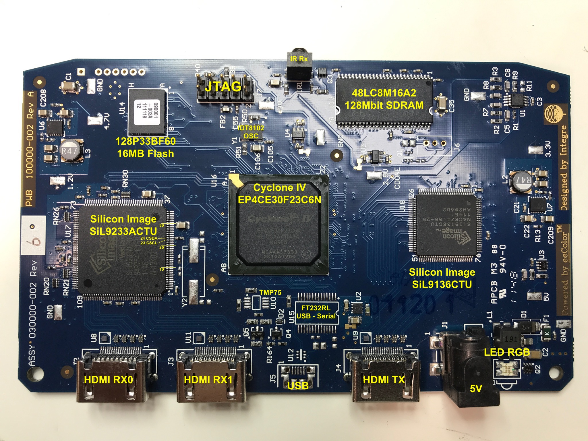

# Introduction

This repo contains information about the (obsolete) eeColor Color3 board.

Most of the information on this page  was copied from 
[this blog post](http://www.taylorkillian.com/2013/04/using-fpga-of-eecolor-color3.html) by Taylor Killian. That blog
posts got [attention on Hackaday](https://hackaday.com/2013/05/08/hdmi-color-processing-board-used-as-an-fpga-dev-board-to-mine-bitcoins/), though
no additinal useful information was added.

My log about reverse engineering this board can be found on [this Hackaday project page](https://hackaday.io/project/122480-eecolor-color3).

# The Board



# Components

* Altera Cyclone IV EP4CE30F23C6N FPGA
* 128P33BF60 16MByte parallel flash
    This flash is used to configure the FPGA on the board at bootup.
    The bitstream takes up around 9MB, so 7MB can be used for other purposes.
* Micron MT48LC8M16A2-75
    128Mbit DRAM (4M x 16bits). 133MHz.
* Silicon Image SiI9233ACTU 4-port HDMI Receiver
* Silicon Image SiI9136ACTU HDMI Transmitter
* IDT8102 Oscillator
* FTDI232RL USB to Serial

    Not populated!

* TMP75 temperature sensor

    Not populated

# FPGA IO Assigments

See the [pinout.txt](pinout.txt) file.

The following IO groups have been identified:

* Oscillator
* LEDs
* IR receiver
* Button
* SDRAM

Since all major chips are using LVTTL compatilbe IOs, all FPGA IO banks are set to 3.3V as well.

# Silicon Image Chips

One of the really nice features of the Silicon Image chips is that they support HDCP 1.4. This version of
HDCP may be completely broken (with a little bit of googling, everybody could create their own keys if they
wanted to), but it's still pretty much impossible for a hobbyist decode live HDCP 'protected' video content.

With this board, one should be able to work around that.

A big caveat here is that the programming guide for these chips is available only under NDA for HDCP license
holders.

The best we can hope for is that somebody can get these chips to work by spying transactions on the I2C bus that runs
between the FPGA and the SI chips.

All voltages on the Silicon Image chips are 3.3V LVTTL.

## SiI9233 HDMI Receiver

There is a [SiI9233 Linux driver] which contains all the I2C registers etc. This should be sufficient to get
the chip programmed for non-protected video input.

## Si9136 HDMI Transmitter

There is no Linux driver for this chip. However, there is the [Terasic HDMI-FMC daughter card] which contains SiI9136-3 
device. This daughter card also comes with a CD-ROM that contains an example with full source code to do an HDMI RX-HDMI TXa
loopback. Even better: the CD-ROM can be downloaded [here](http://download.terasic.com/downloads/cd-rom/hdmi-fmc/).

The only difference between the SiI9136-3 and SiI9136 seems to be the maximum pixel clock frequency (300MHz vs 165MHz), so
it's very likely that this source code works with the regular SiI9136 to work as well.

On the CD-ROM, the key code can be found here: ```Demonstration/tr5_fmcd_hdmi_rx_tx/software/TR5_FMC_HDMI/HDMI_TX.c:InitSII9136```.

While the code does not have anything like #defines, it should be sufficient to get something good going.

There are other way to get programming information for these chips as well. For example, one could google
"SiI9022A and SiI9024A Transmitter Programming Interface" and get lucky. The registers described in a document
like that could be very similar as those that are used in the ```InitSII9136``` routine mentioned earlier.

# SDRAM

Somebody was able [get the DRAM to work](http://www.taylorkillian.com/2013/04/using-fpga-of-eecolor-color3.html?showComment=1369193665410#c9082819817087076428): 

>  I'm using the "SDRAM Controller" module set to custom with a data width of 16, chip select 1, 
>  banks 4, row 12, and column 8. Then I'm using ALTPLL to generate the 133MHz clock needed using 
>  a multiplication factor of 16 and division of 3.

The SDRAM runs 3.3V as well.

Like the SI chips, the SDRAM IO pins are 3.3V LVTTL compatiable as well.

# IDT8102 Oscillator

These oscillators can be factory programmed to a wide range of clocks. The one on this board apparently has been programmed to 25MHz.

# FT232RL

The board has unpopulated sockets for a USB connector, and an FTDI FT232RL chip. Having this would make this board even more useful
as a general purpose development board.

# TMP75 (speculative)

According to one commenter on the Taylor Killian blog post that started it all, there is an empty socket on the board that
can be used to populated with a TMP75 temperature sensor. According to the TMP75 datasheet, this sensor has an 8-pin package. 
On my board, there is an empty 8-pin footprint called U10 that is located right next to the empty U15 footprint of the FT232RL,
so I assume that this is where the sensor would go.

# Resources

* [EP4CE420 Pin Information](https://www.altera.com/content/dam/altera-www/global/en_US/pdfs/literature/dp/cyclone-iv/ep4ce30.pdf)
* [Micron 48LC8M16A2 datasheet](https://www.micron.com/parts/dram/sdram/mt48lc8m16a2f4-75-it)

* [SiI9233A datasheet](http://www.latticesemi.com/view_document?document_id=51624). 
  [Copy on Arrow Electronics](https://www.arrow.com/en/products/sii9233actu-c/lattice-semiconductor)
* [SiI9233 Linux driver]
* [SiI9136 datasheet](http://www.latticesemi.com/view_document?document_id=51622)
* [FT232TL datasheet](http://www.ftdichip.com/Support/Documents/DataSheets/ICs/DS_FT232R.pdf)
* [TMP75 datasheet](http://www.ti.com/product/TMP75)

[SiI9233 Linux driver]:https://github.com/endlessm/linux-meson/tree/master/drivers/amlogic/ext_hdmiin/sii9233
[Terasic HDMI-FMC daughter card]:http://www.terasic.com.tw/cgi-bin/page/archive.pl?Language=English&CategoryNo=66&No=1067
